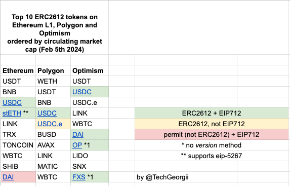
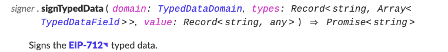
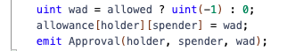
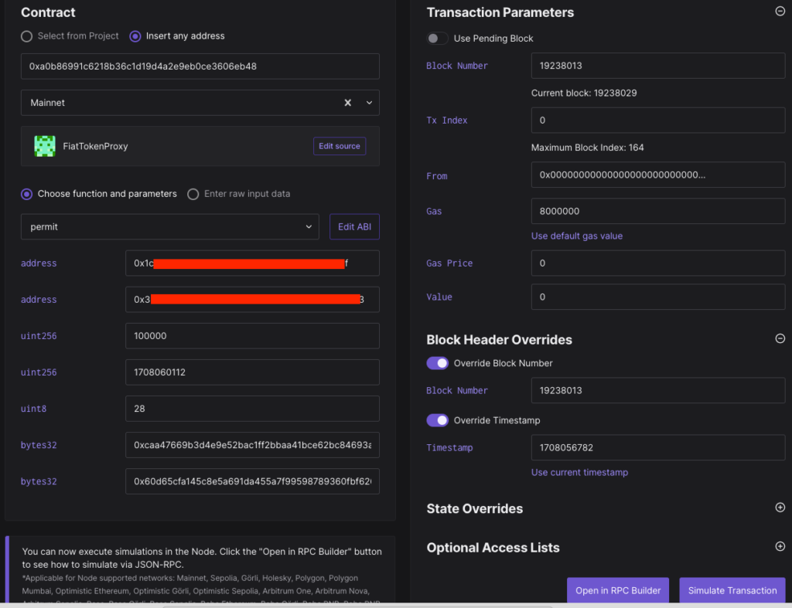

Browsing the crypto Twitter/X, I found a service [smolrefuel.com](http://smolrefuel.com), ([tweet](https://twitter.com/0xngmi/status/1754243629588087072)), which solves the problem of obtaining a gas token on Ethereum networks if you don't have one, for example when you withdraw a stablecoin from an exchange. I did a little research on how it works. A high-level overview:

1. User with wallet _W_ selects token _T_ (for example, USDC) to convert to gas (native) token.

2. User signs with their wallet an off-chain (thus no gas is needed) signature, a permit _A,_ that authorizes that:

   1. _S_(mart Contract) is allowed to withdraw from wallet _W_(allet) an amount _V_(alue) in token _T_(oken) by a certain date _D_(eadline). I.e., allows the possibility to call approve method of ERC20 with this signature.

   2. _S_ is the smolrefuel's smart contract.

3. The signature _A_ is passed to the service's backend, contract _S_ is given permission to withdraw a certain amount. Then, S withdraws this amount from the user's wallet, swaps on a DEX for the native token, takes its fee, transfers the native token to wallet W.

## ERC-2612

The foundation of this is [ERC-2612](https://eips.ethereum.org/EIPS/eip-2612). Its main part – the _permit_ function, implemented for token _T_:

```typescript
function permit(address owner,
    address spender,
    uint value,
    uint deadline,
    uint8 v, bytes32 r, bytes32 s)
```

This functions tells a contract: please allow _spender_ spend _value_ tokens from _owner_'s wallet, here's the signature. Triple (v, r, s) is essentially that signature _A_, signed by the _owner_ (_W_). This is the output of [secp256k1](https://en.bitcoin.it/wiki/Secp256k1) algorithm. Its remarkable property is that it is easy to recover who exactly signed the signature. _permit_ function also checks that signature is not expired thru _deadline_ parameter.

To prevent replay attacks, when signature constructed on another chain or for another token can be reused, a unique _domain_ key is used. According to [EIP-712](https://eips.ethereum.org/EIPS/eip-712), in order for domain to be unique, token name, contract version, chain id, contract address, and sometimes salt are used. It is a constant value for each token and _almost_ never changed.

Also, to make a signature, a nonce (an increment value) mechanism is used, so that every next signature will be unique regardless of other params.

Here is how signing is done (pseudocode):

```typescript
// unique domain
domain = {
  name: "Token Name",
  version: "1",
  chainId: "137",
  verifyingContract: "0xAaAaa...."
}

// params for permit
values = {
  owner: W,         // wallet W
  spender: S,       // allowed spender
  value: V,         // how much to spend, e.g. 100000000
  nonce: getNonce(T, W) // nonce (incremented value),
  deadline: D       // e.g., an hour from now on.
}

A = signTypedData(domain, values) // let's sign data and get A
```

Okay, we now have signature _A_. That's how we can call contract's _permit_ method (pseudocode):

```typescript
v, r, s = splitSignature(A) // get signature's A components v, r, s
T.permit(owner: W, spender: S, value: V, deadline: D, v, r, s)
```

It is important that _permit_ does not check the caller – it means for the signer this can be completely gas-free – some another contract can call it. It is the case for smolrefuel.

Let's examine _permit_'s pseudocode (modified [OpenZeppelin implementation](https://github.com/OpenZeppelin/openzeppelin-contracts/blob/master/contracts/token/ERC20/extensions/ERC20Permit.sol)):

```typescript
function permit(address owner, address spender, uint value, uint deadline,
  uint8 v, bytes32 r, bytes32 s) {

    if (deadline > NOW())
      throw error("deadline expired")

    // let's recover the signer
    address signer = recover(DOMAIN_SEPARATOR, v, r, s)

    // signer is not owner
    if (signer != owner)
      throw error("signature invalid")

    // all's as expected, let's give spender a right to withdraw.
    approve(owner, spender, value)
  }
```

_DOMAIN_SEPARATOR_ here is a token-related constant derived from _domain_ above.

## Prototype

To see how ERC2612 works I've created a [prototype](https://github.com/TechGeorgii/erc2612-poc). It is the app consisting of two components.

**front-end** (in react directory) is a web app where user signs an off-chain permit with wallet like Metamask. This permit allows smart contract defined in _src/constants.ts_ (_spenderAddress_ – please set it yourself) to spend 0.1 Polygon [USDC](https://polygonscan.com/address/0x3c499c542cEF5E3811e1192ce70d8cC03d5c3359) from current wallet address _W_. The most interesting part of code is in [App.tsx](https://github.com/TechGeorgii/erc2612-poc/blob/main/react/src/App.tsx), _sendPermit_ function:

```typescript
...
// token properties are loaded above
const values: ValuesDto = {
  owner: eoaAddress!,
  spender: constants.spenderAddress,
  value: ethers.parseUnits("0.1", decimals),
  nonce: nonce,
  deadline: Math.floor(Date.now() / 1000) + 3600,  // 1 hour from now on.
};

const domain: DomainDto = {
  chainId: network!.chainId,
  name: name,
  verifyingContract: constants.tokenAddress,
  version: version,
};

const signature = await signer.current!.signTypedData(domain, constants.permitTypes, values);
const payload: PermitDto = {
  signature: signature,
  values: values,
  domain: domain,
};

// send to backend to call permit gasless.
const resp = await fetch("http://localhost:9001/permit", { method: "POST", headers: { 'Content-Type': 'application/json' }, body: JSON.stringify(payload) });

...
```

**Backend** app (_console_ directory) receives the signature and parameters from front-end and calls _permit_ function on token's smart contract. In order to work, .env file must be created (use copy of [.env.example](https://github.com/TechGeorgii/erc2612-poc/blob/main/.env.example)) with _RPC_URL_ parameter (can be obtained on services like Alchemy, Infura etc) and _PK_ – a private key of an EOA / wallet that will send transaction. **Please don't store private keys as plain text in production like this – here it is for simplicity**. Sender's EOA must have gas token on it required to pay for gas.

The main code is in [index.ts](https://github.com/TechGeorgii/erc2612-poc/blob/main/console/index.ts), POST handler:

```typescript
...
// inp.signature – is a permit signature from front-end
const splitted = ethers.Signature.from(inp.signature);

const tokenContract = new ethers.Contract(
  constants.tokenAddress,
  ABI,
  wallet
);

// call permit on token
const tx = await tokenContract.permit(
  inp.values.owner,
  constants.spenderAddress,
  inp.values.value,
  inp.values.deadline,
  splitted.v,
  splitted.r,
  splitted.s,
  {
    gasLimit: 170000,
  }
);
```

By default, the prototype works with [Polygon USDC](https://polygonscan.com/address/0x3c499c542cEF5E3811e1192ce70d8cC03d5c3359), but in _constants.ts_ any token can be used instead.

## ERC2612 adoption

This is probably the most interesting part. I did a research on how the ERC2612 is implemented for 10 most popular tokens on Ethereum, Polygon and Optimism (the networks I work with the most), and here are the results ([sheet](https://docs.google.com/spreadsheets/d/1tQggMsRzedpyKXhYOHXC0koeW74z_TAZm6k-K6qB6kE/edit?usp=sharing)):



**<mark style="background-color: #7bdcb5;">Green</mark>** are the tokens that implement ERC2612 and EIP712. It is somewhat easy to implement a permit signing (\*).

<mark style="background-color: #fcb900;" class="has-inline-color">Yellow</mark> are the tokens that implement ERC2612 (i.e. _permit_ function), but do not implement EIP712. It is a difficult case as _signTypedData_, implemented in [ethers.js](https://docs.ethers.org/v6/api/providers/#Signer-signTypedData), strictly conforms to EIP712:



Moreover, Metamask implementation of _[eth_signTypedData_v4](https://docs.metamask.io/wallet/reference/eth_signtypeddata_v4/)_ receives _domain_ object (see above) and calculates domain separator internally, that won't match domain separator of such a token computed differently than in EIP-712. This problem can be partially solved if call is done on backend part when one has private key available to send a transaction. _DOMAIN_SEPARATOR_ can be get from token's contract and used in _signTypedData_. ethers.js does not support that, I made a [PR](https://github.com/ethers-io/ethers.js/pull/4606) to ask to include this functionality. It is difficult to say if this scenario has some adoption or not.

I didn't include this in the prototype, although you can do it yourself – don't forget to use modified [ethers.js](https://github.com/TechGeorgii/ethers.js/tree/domain-separator).

<mark style="background-color: #f78da7;">Red</mark> is one token (Ethereum DAI) that has _permit_ implemented but it does not correspond to ERC-2612 (bummer!). It allows two cases: either no allowance or max allowed in Solidity (max uint256 value). I don't know why they [decided it this way](https://remix.ethereum.org/#address=0x6b175474e89094c44da98b954eedeac495271d0f); probably it was before ERC2612 went live. _permit_ has _allowed: bool_ parameter:



And that's not all! In order to sign the permit, we need to construct _domain_ and set its fields. It is trivial except for _version_ field. Asterisk (\*) marked tokens don't have public _version()_ function, so I had to brute force actual version and put it after the asterisk. But if token developer decides to change it, you get a trouble.

As far as I know, _version()_ is not in the standards but rather voluntarily implemented by token's developer. To solve this problem, [EIP-5267](https://eips.ethereum.org/EIPS/eip-5267) was introduced, but it is only supported by stETH (\*\*), see the table…

## Tools

A big shot-out to [tenderly](https://tenderly.co/) – an Ethereum debugger, that I used to debug _permit_ calls when they weren't successful, and also to simulate a transaction on Ethereum to save gas tokens – a killer feature IMO:



## Conclusion and results

I got mixed feelings after completion of this research. On the one hand, there are standards that can ease usability of Ethereum dApps and increase adoption. On the other hand, out of 30 popular tokens only 8 support approve permits, and for three of them special handling is required (two for _version()_ and one for non-standard _permit()_ function). Looks like not nearly enough for mass adoption.

Also, in case of development of your dApp, I would budget in additional time for adding every token as it can be non-trivial if you work with something more fancy than ERC-20.

––––

Follow me on X / Twitter [@TechGeorgii](https://x.com/techgeorgii)

I am also a co-founder of a [software development company](https://aspirity.com), so in case you have a custom project in Ethereum or Web2 space, or looking for additional bandwidth, please reach out on [Telegram](https://t.me/georgiisavchenko) (preferred) or Twitter
