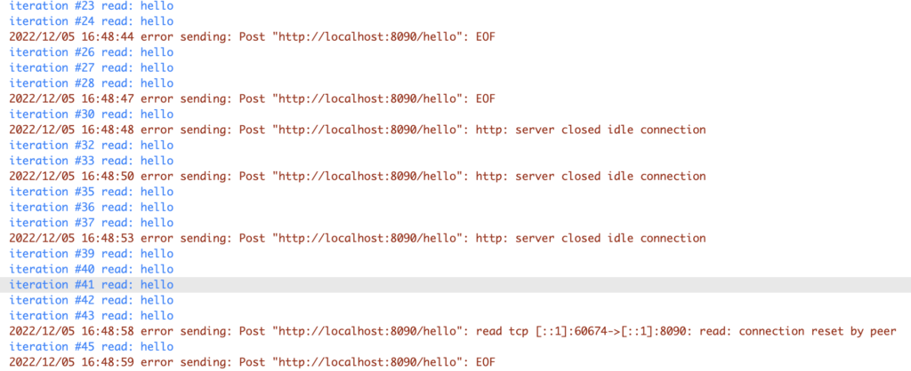

## Error

I was getting a floating error “read tcp [::1]:60674->[::1]:8090: read: connection reset by peer” in my Go code when making a HTTP POST request to another service at localhost:8090 with pretty standard *http.Post* method:

```go
res, err := http.Post("http://localhost:8090/hello", "text/json", bytes.NewReader(nil))
```

Fix turned out to be tricky and a simple one at the same time.

## Reproducing error

Let’s try to reproduce this behaviour with the following Go code. It is basically a simple web-server on http://localhost:8090/hello (no matter the HTTP method it is called) and returning “hello” string in response body (wrapping omitted for clarity, full version is on [Github](https://github.com/TechGeorgii/go-keep-alive-http/blob/main/server/server.go)):

```go
mux := http.NewServeMux()
mux.HandleFunc("/hello", func(w http.ResponseWriter, req *http.Request) {
	fmt.Fprintf(w, "hello\n")
})

srv := &http.Server{
	Addr:        ":8090",
	Handler:     mux,
	IdleTimeout: time.Millisecond * 200,
}
srv.ListenAndServe()
```

The important thing here is *IdleTimeout* setting set to 200 ms. Let’s leave it for now.

Let’s make multiple HTTP POST requests to our server exactly every 200 ms (server’s *IdleTimeout*) ([full code](https://github.com/TechGeorgii/go-keep-alive-http/blob/main/client/client.go)):

```go
for i := 0; i < 100; i++ {
	res, err := http.Post("http://localhost:8090/hello", "text/json", bytes.NewReader(nil))
	if err != nil {
		log.Printf("error sending: %s", err)
		continue
	}

	body, err := ioutil.ReadAll(res.Body)
	if err != nil {
		log.Printf("error reading: %s", err)
		continue
	}

	fmt.Printf("iteration #%0d read: %s", i, string(body))
	time.Sleep(time.Millisecond * 200)
}
```

And we’ll start getting errors:

- Post “http://localhost:8090/hello”: EOF
- Post “http://localhost:8090/hello”: http: server closed idle connection
- Post “http://localhost:8090/hello”: read tcp [::1]:60674->[::1]:8090: read: connection reset by peer



## Explanation

HTTP 1.1 connections are **persistent**. It means, when client makes an HTTP request, the connection is not actually closed, but rather kept “alive” so that next request can reuse it without the burden of opening new connection again [[1](https://en.wikipedia.org/wiki/HTTP_persistent_connection#cite_note-RFC-7230-6.3-4)].

In the above example, server’s *IdleTimeout* (timeout during which server considers connection as idle without closing it) was 200 ms so was our request interval. And sometimes when the client was about to make a POST request on “existing” connection, the server was closing that connection and we were getting these errors.

`But what, why do I have to worry about such low-level stuff?? Why doesn't the client just retry the request?`

According to [RFC 7230 6.3.1 and 4.2.2.](https://datatracker.ietf.org/doc/html/rfc7230#section-6.3.1), the client **must not retry non-idempotent requests when connection is closed**. Non-idempotent methods are POST and PATCH.

> ```text
A request method is considered "idempotent" if the intended effect on
   the server of multiple identical requests with that method is the
   same as the effect for a single such request
```
>
> [RFC 7230 4.2.2](https://datatracker.ietf.org/doc/html/rfc7231#section-4.2.2)

In simple words, POST is used to create NEW record. And if it is executed multiple times, multiple records would be added. In case of closing connection client can’t be 100% sure whether request was executed by the server or not, so it is not safe to retry a request. On the other hand, GET request is idempotent as it does not matter how many times it is called – server will remain in the same state.

## Fixing the problem

It depends on your situation, there are multiple options:

**Option 1**. Use GET request:

If your request does not modify any data, you can use GET method. Simply changing line 2 in client code to GET removes this error. In this case http client makes a retry automatically:

```go
res, err := http.Get(url)
```

**Option 2**. Disable persistent connection on client side:

In this case, a client would use a single connection for each HTTP request. The downside here is the increased overhead for opening and closing new connections.

```go
t := http.DefaultTransport.(*http.Transport).Clone()
t.DisableKeepAlives = true
c := &http.Client{
	Transport: t,
}

for i := 0; i < 100; i++ {
	res, err := c.Post("http://localhost:8090/hello", "text/json", bytes.NewReader(nil))
...
// rest of code goes as above
```

**Option 3**. Reduce connection timeout on client side to be less than server’s:

In this case unused connection would be closed by the client earlier than by the server, so http client will not encounter these types of errors.

```go
t := http.DefaultTransport.(*http.Transport).Clone()
t.IdleConnTimeout = time.Millisecond * 100
c := &http.Client{
	Transport: t,
}

for i := 0; i < 100; i++ {
	res, err := c.Post("http://localhost:8090/hello", "text/json", bytes.NewReader(nil))
...
// rest of code goes as above
```

## Conclusion

I tried to explain what’s the root cause of errors when making HTTP requests in Go:

- EOF
- http: server closed idle connection
- read tcp: read: connection reset by peer

There can be multiple reasons why these errors appear, here we explained them in relation to HTTP persistent connections. Now you get what’s happening under the hood so you can apply a correct and thoughtful fix.

[All source code is on Github](https://github.com/TechGeorgii/go-keep-alive-http).

Article discussion in [my Twitter](https://twitter.com/TechGeorgii/status/1599741568382296064).
