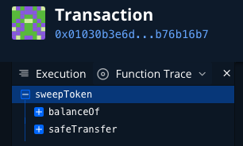
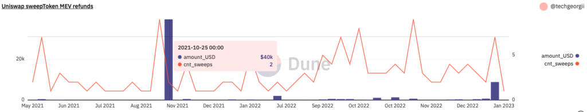
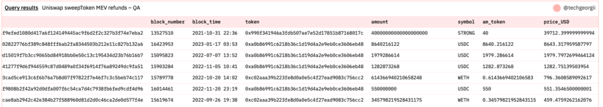
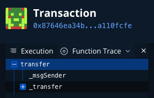
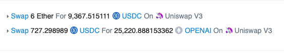
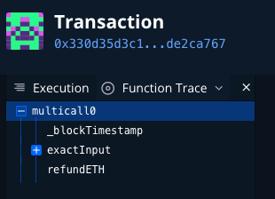
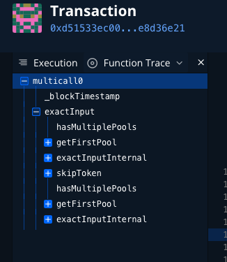

After [previous article about Uniswap’s SwapRouter bug](https://techgeorgii.com/uniswaps-swaprouter-refund-bug-how-much-mev-bots-can-earn/) that permits unspent ETH to be left in SwapRouter and then picked up by a MEV bot, I got replies on Twitter that there is also a possibility to left funds in SwapRouter when swapping ERC-20 tokens.

To sweep ERC20 tokens that may have left in SwapRouter after swap, Uniswap proposed two functions – *[sweepToken](https://github.com/Uniswap/v3-periphery/blob/6cce88e63e176af1ddb6cc56e029110289622317/contracts/base/PeripheryPayments.sol#L30)* and *[sweepTokenWithFee](https://github.com/Uniswap/v3-periphery/blob/6cce88e63e176af1ddb6cc56e029110289622317/contracts/base/PeripheryPaymentsWithFee.sol#L37)* – they need to be called after a swap. Case is similar to *refundETH* from [previous article](https://techgeorgii.com/uniswaps-swaprouter-refund-bug-how-much-mev-bots-can-earn/). I recommend you to read it first to familiarise yourself with the concepts as basics will be omitted here for clarity.

So I decided to do similar research for *sweepToken* and *sweepTokenWithFee*.

## Idea

To calculate how much MEV bots could make exploiting this, I decided to calculate:

> Let’s find out how many such *sweepToken* and *sweepTokenWithFee* calls that are not a part of complex swap transaction (example tx [0x01030b3e6d9f80d15019f7b3cc9065bd84918bb0e50c13c195434d23b76b16b7](https://etherscan.io/tx/0x01030b3e6d9f80d15019f7b3cc9065bd84918bb0e50c13c195434d23b76b16b7)).

That’s how it looks in [Tenderly](https://dashboard.tenderly.co/tx/mainnet/0x01030b3e6d9f80d15019f7b3cc9065bd84918bb0e50c13c195434d23b76b16b7/debugger) – just a single sweepToken call.



The idea here is that it is probably a MEV bot that aims to spend as little gas as possible while sweeping the funds.

So as an end result, let’s write an SQL query in Dune to find out such sweeps, calculate amount in USD and number of sweeps for each week starting from May 2021 (SwapRouter was published).

## Data extraction

**Step 0 – brief solution idea**

We need to scan *ethereum.traces* [table](https://dune.com/docs/tables/raw/traces/) for single **[sweepToken](https://github.com/Uniswap/v3-periphery/blob/6cce88e63e176af1ddb6cc56e029110289622317/contracts/base/PeripheryPayments.sol#L30)** calls that are not part of a complex tx, then find corresponding ERC20 *[transfer(address recipient, uint256 amount)](https://github.com/OpenZeppelin/openzeppelin-contracts/blob/591c12d22de283a297e2b551175ccc914c938391/contracts/token/ERC20/ERC20.sol#L113)* calls to figure out the amount of token swept, then find USD prices at the time of transfer. Do the same for *sweepTokenWithFee*.

**Step 1 – find single *sweepToken* calls**

1. *input* column starts with [0xdf2ab5bb](https://www.4byte.directory/signatures/?bytes4_signature=0xdf2ab5bb) (Keccak256).
2. *trace\_address* array is [] (empty) – it means it is a high level call.
3. *to* is either [SwapRouter](https://etherscan.io/address/0xE592427A0AEce92De3Edee1F18E0157C05861564) or [SwapRouter02](https://etherscan.io/address/0x68b3465833fb72A70ecDF485E0e4C7bD8665Fc45)
4. *tx\_success* = true (successful tx)
5. *block\_time* > ‘2021-05-01’ (look after SwapRouter is published).

**Step 2 – find corresponding ERC20 transfer**

Then to get how much assets were swept, scan same table for transfer method call:

1. *input* column starts with [0xa9059cbb](https://www.4byte.directory/signatures/?bytes4_signature=0xa9059cbb) (*[transfer(address recipient, uint256 amount)](https://github.com/OpenZeppelin/openzeppelin-contracts/blob/591c12d22de283a297e2b551175ccc914c938391/contracts/token/ERC20/ERC20.sol#L113)* call)
2. Same block and tx hash.
3. *trace\_address* array length is 1 (nested call by *sweepToken*).

**Step 3 – find USD prices**

We can look up [prices.usd](https://dune.com/docs/tables/spells/prices/#pricesusd) table for token that was transferred on step 2:

1. Join by *contract\_address* and *minute* columns.

**Step 4 – implement query**

The query is pretty straightforward. On step 1 we need to extract token address (first parameter of ***[sweepToken](https://github.com/Uniswap/v3-periphery/blob/6cce88e63e176af1ddb6cc56e029110289622317/contracts/base/PeripheryPayments.sol#L30)***) from *input* column (token address is in bold) – this is done by simple substring:

0xdf2ab5bb000000000000000000000000**a0b86991c6218b36c1d19d4a2e9eb0ce3606eb48**0000000000000000000000000000000000000000000000000000000075f98455000000000000000000000000777d0dcc4615ccfe3e575c20219fdf0bbe8251c7

On step 2 we need to extract *amount* param from *[transfer](https://github.com/OpenZeppelin/openzeppelin-contracts/blob/591c12d22de283a297e2b551175ccc914c938391/contracts/token/ERC20/ERC20.sol#L113)* function call. HEX string of token amount is in bold, this is *input* column as well:

0xa9059cbb000000000000000000000000777d0dcc4615ccfe3e575c20219fdf0bbe8251c7**0000000000000000000000000000000000000000000000000000000075f98456**

These extractions are easily done by Dune SQL byte array and substring functions.

Then we need to group by week. The resulting query is ([Dune](https://dune.com/queries/1934197)):

```sql
WITH
raw_sweeps AS
(
    SELECT
        tr_sweep.tx_hash,
        tr_sweep.block_number,
        tr_sweep.block_time,
        lower('0x' || substr(tr_sweep.input, 35, 40)) AS token,
        bytearray_to_uint256('0x' || substring(tr_transf.input, -64)) AS amount
    FROM ethereum.traces tr_sweep
        JOIN ethereum.traces tr_transf ON
                tr_transf.block_time = tr_sweep.block_time    -- same block
                AND tr_transf.tx_hash = tr_sweep.tx_hash      -- same hash
                AND COALESCE(cardinality(tr_transf.trace_address), 0) = 1 -- subcall
                AND starts_with(lower(tr_transf.input), '0xa9059cbb') -- transfer(address,uint256)
    
    WHERE
        tr_sweep.block_time > DATE '2021-05-01'
        AND starts_with(lower(tr_sweep.input), '0xdf2ab5bb') -- sweepToken
        AND tr_sweep.tx_success
        AND COALESCE(cardinality(tr_sweep.trace_address), 0) = 0 -- high level call
        AND (tr_sweep.to = 0xE592427A0AEce92De3Edee1F18E0157C05861564 OR tr_sweep.to = 0x68b3465833fb72a70ecdf485e0e4c7bd8665fc45) -- to SwapRouter
    ORDER BY tr_sweep.block_time DESC
),
sweeps AS
(
    SELECT rs.*,
        toks.symbol,
        (CAST(rs.amount AS double) / POW(10, toks.decimals)) AS am_token,
        (CAST(rs.amount AS double) / POW(10, toks.decimals)) * COALESCE(price.price, 0) AS price_USD
    FROM raw_sweeps rs
        LEFT JOIN tokens.erc20 toks ON toks.contract_address = rs.token AND toks.blockchain = 'ethereum'
        LEFT JOIN prices.usd price ON 
            price.contract_address = rs.token
            AND price.minute = date_trunc('minute', rs.block_time) AND price.blockchain = 'ethereum'
)
SELECT 
    date_trunc('week', block_time) AS week,
    SUM(price_USD) AS amount_USD,
    COUNT(*) AS cnt_sweeps,
    arbitrary(tx_hash) AS example_tx
FROM sweeps
GROUP BY 1
ORDER BY 1 DESC
```

Here is the visualisation:



To check the correctness here is the [QA query](https://dune.com/queries/1947141) on Dune that gives biggest sweeps sorted by biggest USD amount:



Turned out there were no single *[sweepTokenWithFee](https://github.com/Uniswap/v3-periphery/blob/6cce88e63e176af1ddb6cc56e029110289622317/contracts/base/PeripheryPaymentsWithFee.sol#L37)* sweeps, so I omitted it for clarity.

## Analysis

I analysed 3 biggest sweeps, tried to figure out how funds were left in SwapRouter with [this query](https://dune.com/queries/1946148):

- For [$39712.39](https://etherscan.io/tx/0xeb9e5e00c69f65f9efed1080d417a6f124149445ac9f6d2f2c327b3f74e7eba2) (40 STRONG) MEV sweep there was a transfer of 40 STRONG to SwapRouter in tx [0x87646ea34bccacefc5f1fae08478927c119e6870890679d4fcc78c3da110fcfe](https://dashboard.tenderly.co/tx/mainnet/0x87646ea34bccacefc5f1fae08478927c119e6870890679d4fcc78c3da110fcfe/debugger) (have no idea why it was done this way – probably some implementation error). So it wasn’t even a swap but looks like some preparation for swap.



- For [$8643.31](https://etherscan.io/tx/0x3454f0c629452a02822776bf389c848fff6ab2fa8344503b212e11c827b132a6) sweep there was a [swap tx](http://0x330d35d3c1599d58f83f7276c076df5d10c037f2aff5d9f16d63bfe7de2ca767) that left whopping 8640.216122 USDC in SwapRouter:



[Etherscan](http://0x330d35d3c1599d58f83f7276c076df5d10c037f2aff5d9f16d63bfe7de2ca767)



[Tenderly](https://dashboard.tenderly.co/tx/mainnet/0x330d35d3c1599d58f83f7276c076df5d10c037f2aff5d9f16d63bfe7de2ca767/debugger)

Swap performed partially due to absence of liquidity, but *sweepToken* wasn’t called (*refundETH* was called, that didn’t help in this case).

- [$1979.79](http://0x01030b3e6d9f80d15019f7b3cc9065bd84918bb0e50c13c195434d23b76b16b7) sweep and [swap tx](https://etherscan.io/tx/0xd51533ec0067a173caadb9a09ab47d9a1df5f3a08aa97cd31a142ce5e8d36e21) performing partial swap that led to 1979.286614 USDC being left in SwapRouter.


In this call, according to [Tenderly](https://dashboard.tenderly.co/tx/mainnet/0xd51533ec0067a173caadb9a09ab47d9a1df5f3a08aa97cd31a142ce5e8d36e21/debugger), wasn’t even a try to refund unspent funds:



## Conclusion

In this article I tried to calculate how much in USD of ERC20 tokens were swept by MEV bots calling *[sweepToken](https://github.com/Uniswap/v3-periphery/blob/6cce88e63e176af1ddb6cc56e029110289622317/contracts/base/PeripheryPayments.sol#L30)* in a single call. Looks like it is slightly more than $50K on Mainnet, but the distribution is very uneven with few big spikes. Except the first case ([$39712.39](https://etherscan.io/tx/0xeb9e5e00c69f65f9efed1080d417a6f124149445ac9f6d2f2c327b3f74e7eba2) sweep), it looks like the reason of lost funds is users not calling *sweepToken* and Uniswap didn’t add any protection to prevent this, that they should have been done IMO.

Future research to understand the real severity of this bug (as was pointed out in the comments on Twitter) is to set up archive node and filter all swap txs that left SwapRouter with some funds and then sum them up.

For now I would strongly advise to use Uniswap [router-sdk](https://github.com/Uniswap/router-sdk/blob/7d989fbe285abf32a63c602221cd136651e39103/src/swapRouter.ts#L450) whenever possible where they seem to have these refund checks.

If you have something to say – welcome to this [Twitter thread](https://twitter.com/TechGeorgii/status/1620396091786264577).
