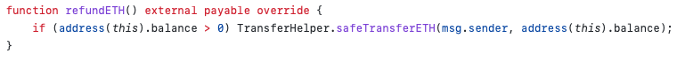
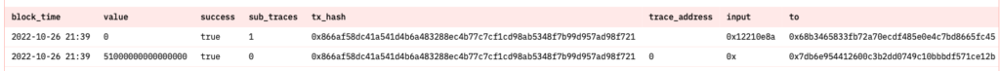
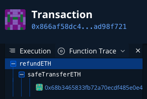
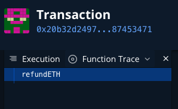
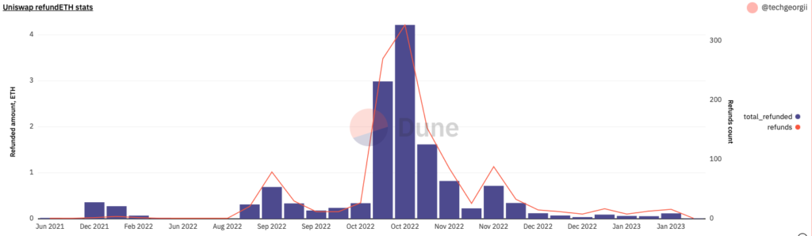
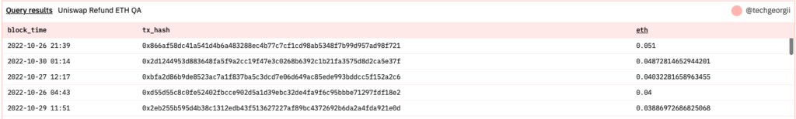

Inspired by [the post](https://jeiwan.net/posts/public-bug-report-uniswap-swaprouter/) of ***Jeiwan*** about Uniswap’s SwapRouter bug (or feature?), I became curious to calculate **how much MEV bots have earned so far exploiting this behaviour**.

A short recap, the bug/feature is that some unfortunate user can construct such a call to SwapRouter so that some ETH will be left in the SwapRouter after a swap. According to Uniswap’s view, these funds must be claimed back by refundETH call on SwapRouter in the same transaction via [multicall](https://docs.uniswap.org/contracts/v3/reference/periphery/base/Multicall) functionality. But what if original called didn’t call refundETH? Then some MEV bot can call refundETH and pick up these funds from SwapRouter.

If you prefer schematics:

*Possibility of funds loss*:

1. tx1 (user):  
   1. User swaps ETH for something else (not calling refundETH).
   2. Some unused ETH are left in SwapRouter.
2. tx2 (MEV bot):
   1. MEV bot calls swapRouter.refundETH picking up remaining funds

*Uniswap’s proposed usage*:

1. tx1 (user via multicall):
   1. User swaps ETH for something else.
   2. Some unused ETH are left in SwapRouter.
   3. User calls swapRouter.refundETH sweeping remaining ETH back.
2. tx2 (MEV bot): cannot pick up remaining funds

## Idea

***I decided to calculate, how much MEV bots have earned so far on this exploit.*** To do so, I came up with the idea:

> Let’s have a look at single *refundETH* calls, where they happen not in part of complex tx, but alone ([example](https://etherscan.io/tx/0x866af58dc41a541d4b6a483288ec4b77c7cf1cd98ab5348f7b99d957ad98f721) tx 0x866af58dc41a541d4b6a483288ec4b77c7cf1cd98ab5348f7b99d957ad98f721).

Most likely, it’d be a MEV bot, since if *refundETH* is called as part of swap tx, it is probably a multicall swap.

We also need to handle the case when *address(this).balance* is 0 (*refundETH* was called, but there was no funds in SwapRouter).



BTW, there are two V3 SwapRouters – [SwapRouter](https://etherscan.io/address/0xE592427A0AEce92De3Edee1F18E0157C05861564) and [SwapRouter02](https://etherscan.io/address/0x68b3465833fb72A70ecDF485E0e4C7bD8665Fc45), you can find *refundETH* method in both of them (Contract->Code tab on Etherscan).

## Data extraction

To aggregate the data I used [Dune](https://dune.com/), a blockchain analytics platform. Here is the idea (let’s use transaction [0x866af58dc41a541d4b6a483288ec4b77c7cf1cd98ab5348f7b99d957ad98f721](https://etherscan.io/tx/0x866af58dc41a541d4b6a483288ec4b77c7cf1cd98ab5348f7b99d957ad98f721) as example):

**Step 1**

Use *ethereum.traces* [table](https://dune.com/docs/tables/raw/traces/):

```sql
SELECT block_time, value, success, sub_traces, tx_hash, trace_address, input, to
FROM ethereum. traces
WHERE   block_number = 15834990
        AND tx_hash = 0x866af58dc41a541d4b6a483288ec4b77c7cf1cd98ab5348f7b99d957ad98f721
```

the result is:



Some important observations in here:

1. Tx consists of two calls.
2. First call is *refundETH* call (*input* column 0x12210e8a is its [signature](https://www.4byte.directory/signatures/?bytes4_signature=0x12210e8a)) to [SwapRouter02](https://etherscan.io/address/0x68b3465833fb72A70ecDF485E0e4C7bD8665Fc45) (*to* column)
3. For first call sub\_traces = 1 (meaning there are child calls).
4. Second is transfer of 0.051 ETH back to 0x7db6… address (MEV bot).
5. trace\_address of first (parent) call is a prefix for second *trace\_address* ([] is prefix of [0] – it is array).
6. In case of single *refundETH* method call there always will be two calls like this.

We can verify [this tx](https://dashboard.tenderly.co/tx/mainnet/0x866af58dc41a541d4b6a483288ec4b77c7cf1cd98ab5348f7b99d957ad98f721) in Tenderly – a call to safeTransferETH is seen.



In case when SwapRouter’s balance is 0, there will be one row in *ethereum.traces* for this tx ([Tenderly](https://dashboard.tenderly.co/tx/mainnet/0x20b32d2497edb76b7248f688159be2708fc7399f3db6201310ed436787453471/debugger) example for 0x20b32d2497edb76b7248f688159be2708fc7399f3db6201310ed436787453471):



**Step 2 – constructing the query**

The algorithm is the following. Select from *ethereum.traces* where:

1. input = 0x12210e8a (refundETH method)
2. trace\_address is [] (empty array) – means a high-level call of refundETH
3. to is either [SwapRouter](https://etherscan.io/address/0xE592427A0AEce92De3Edee1F18E0157C05861564) or [SwapRouter02](https://etherscan.io/address/0x68b3465833fb72A70ecDF485E0e4C7bD8665Fc45)
4. tx\_success = true (successful tx)
5. sub\_traces = 1 (there is a child call – transferring ETH)

Then also join with *ethereum.traces* to find an ETH transfer row:

1. Same tx\_hash
2. Same block\_time – for speed
3. Length of trace\_address is 1 (e.g. [1], a single-element array).

**Step 3 – query implementation**

Then follows SQL query implementation. Latest Dune engine is based on Trino, so you can [read the docs](https://trino.io/docs/current/language.html).

Something to note:

1. Let’s group by week to see amount and number of ETH transfers per week starting from May 2021.
2. Use *COALESCE(cardinality(tr\_transf.trace\_address), 0)* to find array length.
3. I filter on *block\_time > DATE ‘2021-05-01’* (SwapRouter deployed on May 2021), we don’t need earlier data.

Here is the code

```sql
WITH
transfers AS (
    SELECT
        tr_ref.tx_hash
        , CAST(tr_transf.value AS DOUBLE) / 1e18 AS eth
        , tr_ref.block_time
    FROM ethereum.traces tr_ref
        LEFT JOIN ethereum.traces tr_transf ON
            tr_transf.block_time = tr_ref.block_time                    -- same block, for speed
            AND tr_transf.tx_hash = tr_ref.tx_hash                      -- same tx
            AND COALESCE(cardinality(tr_transf.trace_address), 0) = 1   -- (safeTransferETH from Router)
    WHERE 
        tr_ref.input = 0x12210e8a    -- refundETH method
        AND COALESCE(cardinality(tr_ref.trace_address), 0) = 0 -- high-level call
        -- https://docs.uniswap.org/contracts/v3/reference/deployments
        AND (tr_ref.to = 0xE592427A0AEce92De3Edee1F18E0157C05861564 OR tr_ref.to = 0x68b3465833fb72a70ecdf485e0e4c7bd8665fc45) -- to SwapRouter or SwapRouter02
        AND tr_ref.tx_success
        AND tr_ref.sub_traces = 1 -- there is a sub call for safeTransferETH
        AND tr_ref.block_time > DATE '2021-05-01'   -- SwapRouter was deployed in May 2021
)
SELECT
    date_trunc('week', block_time) AS week
    , SUM(eth) AS total_refunded
    , COUNT(*) AS refunds
    , arbitrary(tx_hash) as example_tx
FROM transfers
GROUP BY 1
ORDER BY 1 DESC
```

Query [can be found and run here](https://dune.com/queries/1921908). I created a chart to see the ETH amount and number of refunds by MEV bots per week:



To verify the data, use QA query. [This one](https://dune.com/queries/1922025) lists all successful MEV txs on week of 2022-10-24 (sorted by ETH), so you can verify the aggregated data, look at particular txs:



## Conclusion and future work

In this article I tried to calculate how much MEV bots have earned so far exploiting behaviour of SwapRouter that does not require *refundETH* call as mandatory. Turns out is it not a huge amount (on Mainnet [around 14.3 ETH](https://dune.com/queries/1922651) in total since May 2021), and recently it dropped to 0.05-0.1 ETH per week (someone can study why this happened). The raise in summer 2022 is probably related to [this report](https://hackmd.io/@0x534154/Hy6_66gT5). Also, I calculated the amount for Polygon, Arbitrum, Optimism and it is even lower.

The proposed technique does not include losses of funds that happened when funds being left in SwapRouter were picked up not by MEV bot but by another multicall swap. This could be a direction of future research to understand the severity of this bug. To do this we need to look up *ethereum.traces* for more swap calls like *exactInputSingle* and their relation to refundETH.

If you have something to say, [here is the thread on Twitter](https://twitter.com/TechGeorgii/status/1617840881578708992), follow me up there.
